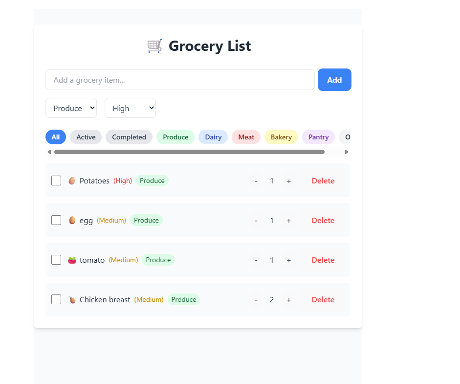

# 🛒 Grocery List App

A modern, feature-rich grocery list application built with React and Vite. This app helps you manage your shopping list with ease, featuring emoji support, categories, priorities, and more!



## ✨ Features

- 📝 Add grocery items with automatic emoji suggestions
- 🏷️ Categorize items (Produce, Dairy, Meat, Bakery, Pantry, Other)
- ⭐ Set priority levels (High, Medium, Low)
- 🔢 Adjust quantities with + and - buttons
- ✅ Mark items as completed
- 🗑️ Delete items
- 🔍 Filter items by category or status
- 💾 Automatic local storage saving
- 🎨 Modern UI with Tailwind CSS

## 🚀 Getting Started

1. Clone the repository
2. Install dependencies:
   ```bash
   npm install
   ```
3. Run the development server:
   ```bash
   npm run dev
   ```
4. Build for production:
   ```bash
   npm run build
   ```
5. Preview production build:
   ```bash
   npm run preview
   ```

## 🛠️ Technologies Used

- React
- Vite
- Tailwind CSS
- Local Storage API

## 📝 Usage

1. Type an item name in the input field (e.g., "eggs", "milk", "bread")
2. Select a category and priority
3. Click "Add" or press Enter
4. The item will be added with an appropriate emoji
5. Use the filter buttons to view different categories or statuses
6. Adjust quantities using the + and - buttons
7. Check items off as you shop
8. Delete items when no longer needed

## 🔄 Updates

- Added emoji support for common grocery items
- Implemented category-based filtering
- Added priority levels for better organization
- Included quantity management
- Added local storage persistence

## 📄 License

MIT License - feel free to use this project for your own purposes!
